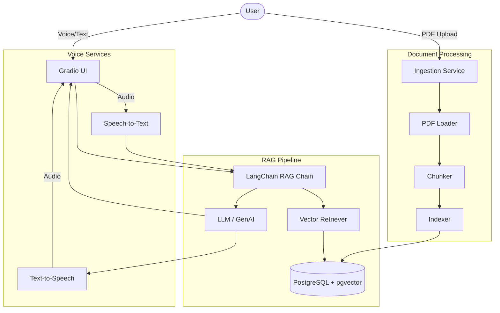

# VOICEPDF: Voice-Enabled Conversational PDF Assistant

## Overview
VoicePDF is a production-quality, voice-enabled conversational RAG (Retrieval-Augmented Generation) application designed to interact intelligently with PDF documents. It incorporates concepts from the NVIDIA RAG course such as LangChain composition, chunking, embeddings, semantic retrieval, and conversational memory, implemented with a clean, extensible architecture.

## Features
- **Upload Multiple PDFs**: Ingest, parse, and chunk multiple PDF files.
- **RAG Pipeline**: Vector embeddings stored in PostgreSQL with pgvector for efficient semantic search.
- **Conversational Memory**: Chat history is maintained for contextual understanding.
- **Source Citations**: Answers are grounded in the document text, with explicit page and source citations.
- **Voice STT/TTS**: Speak to the assistant via microphone, and get audio responses.
- **Multi-PDF Isolation**: Metadata filtering ensures responses come from the selected documents.
- **Anti-Hallucination**: System prompts enforce answering *only* from the provided context.

## Architecture



## Tech Stack
- **Frontend**: Gradio
- **Backend/AI**: Python, LangChain
- **Database**: PostgreSQL with pgvector, SQLAlchemy
- **Embeddings/LLM**: Configurable (Default: OpenAI)
- **Voice**: SpeechRecognition (STT), gTTS (TTS)

## Installation & Setup

1. **Clone the repository** (if applicable) and navigate to the project directory:
   ```bash
   cd voicepdf
   ```

2. **Install requirements**:
   ```bash
   pip install -r requirements.txt
   ```

3. **Environment Setup**:
   Copy the example config and add your API keys:
   ```bash
   cp .env.example .env
   ```

4. **Start the Database**:
   Use Docker Compose to spin up a PostgreSQL instance with pgvector pre-installed:
   ```bash
   docker-compose up -d
   ```

5. **Initialize Database Tables**:
   ```bash
   python scripts/init_db.py
   ```

6. **Run the Application**:
   ```bash
   python app.py
   ```

7. **Run Tests**:
   ```bash
   pytest tests/
   ```

## Evaluation
A basic evaluation script is provided to test retrieval and answering accuracy:
```bash
python evaluation/run_evaluation.py
```

## Interview Explanation
*Why RAG?* RAG allows us to augment the LLM's knowledge with proprietary PDF data, reducing hallucination.
*Why embeddings and pgvector?* Embeddings capture semantic meaning. pgvector allows us to store these vectors alongside metadata in a robust relational database.
*Why chunking?* LLMs have finite context windows. Chunking (with overlap) ensures we capture relevant context without losing semantic boundaries or exceeding token limits.
*How do citations work?* Each chunk retains metadata (`document_name`, `page_number`). The retriever passes this metadata to the prompt, which instructs the LLM to output the citation format.
*Voice integration?* We intercept audio in Gradio, transcribe it (STT), pass the text to the RAG chain, and synthesize the text response back to audio (TTS).

## Limitations & Future Improvements
- Currently relies on external STT/TTS which introduces latency. Could be upgraded to local streaming Whisper/Deepgram models.
- LangGraph could be used to build a robust agent state machine for more complex workflows, such as web fallback or self-correction.
