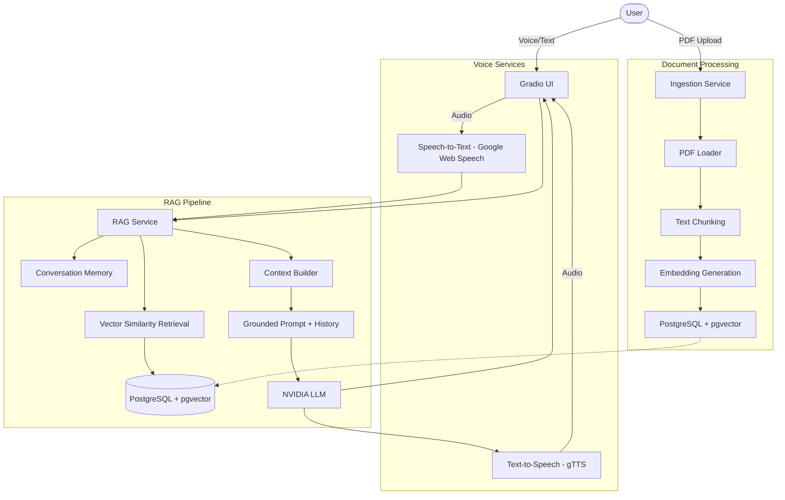

# VoicePDF: Voice-Enabled Conversational PDF Assistant

## Overview
VoicePDF is a production-quality, voice-enabled conversational RAG (Retrieval-Augmented Generation) application designed to interact intelligently with PDF documents. It supports multi-turn conversations with memory, voice input/output, and grounded answers with page-level citations.

**Current Status:** All core phases complete ✅

## Architecture


## Tech Stack
- **Frontend**: Gradio (with voice input/output)
- **Backend/AI**: Python, LangChain
- **Database**: PostgreSQL with pgvector, SQLAlchemy
- **LLM**: NVIDIA NIM API (OpenAI-compatible endpoint)
- **Embeddings**: NVIDIA Nemotron Embed (via same API key)
- **Voice**: SpeechRecognition (STT), gTTS (TTS)
- **Containerization**: Docker + Docker Compose

## Implementation Status
- [x] Clean project architecture & directory structure (Phase 1)
- [x] Configurable environment variables (`.env`) (Phase 1)
- [x] Database connection and SQLAlchemy models (Phase 1)
- [x] PostgreSQL + pgvector Docker setup (Phase 1)
- [x] Gradio UI with voice support (Phase 1 + 5)
- [x] Complete PDF ingestion and chunking (Phase 2)
- [x] Vector indexing and NVIDIA embeddings (Phase 3)
- [x] Semantic retrieval foundation (Phase 3)
- [x] Complete RAG chain & Grounded Generation (Phase 4)
- [x] Voice input — Speech-to-Text with format conversion (Phase 5)
- [x] Voice output — Text-to-Speech with citation stripping (Phase 5)
- [x] Multi-turn conversation memory (Phase 6)
- [x] Evaluation framework with quality metrics (Phase 7)
- [x] Docker containerization with health checks (Phase 8)
- [x] Ingestion service layer extraction (Phase 8)

## Quick Start

### Option 1: Docker (Recommended)

```bash
# 1. Clone the repository
git clone <repo-url>
cd voice-enabled-chat-with-PDF-s

# 2. Configure environment
cp .env.example .env
# Edit .env and set your NVIDIA_API_KEY

# 3. Launch everything
docker-compose up -d

# 4. Open the app
# Navigate to http://localhost:7860
```

### Option 2: Local Development

1. **Python Virtual Environment**:
   ```bash
   python -m venv venv
   source venv/bin/activate  # On Windows: .\venv\Scripts\activate
   ```

2. **Install requirements**:
   ```bash
   pip install -r requirements.txt
   ```

3. **Environment Setup**:
   ```bash
   cp .env.example .env
   # Set your NVIDIA_API_KEY in .env
   ```

4. **PostgreSQL + pgvector Setup**:
   ```bash
   docker-compose up -d db
   ```

5. **Initialize Database**:
   ```bash
   python scripts/init_db.py
   ```

6. **Run the Application**:
   ```bash
   python app.py
   # Open http://localhost:7860
   ```

7. **Run Tests**:
   ```bash
   pytest tests/ -v
   ```

## Configuration

All configuration is done via `.env` file. Key settings:

| Variable | Default | Description |
|----------|---------|-------------|
| `LLM_PROVIDER` | `nvidia` | LLM provider (nvidia or openai) |
| `LLM_MODEL` | `meta/llama-3.2-11b-vision-instruct` | Model for text generation |
| `NVIDIA_API_KEY` | — | Your NVIDIA NIM API key |
| `NVIDIA_BASE_URL` | `https://integrate.api.nvidia.com/v1` | NVIDIA API endpoint |
| `EMBEDDING_PROVIDER` | `nvidia` | Embedding provider (nvidia or openai) |
| `EMBEDDING_MODEL` | `nvidia/nemotron-3-embed-1b` | Model for embeddings |
| `TOP_K` | `5` | Number of chunks to retrieve |
| `CHUNK_SIZE` | `1000` | Characters per chunk |
| `CHUNK_OVERLAP` | `200` | Overlap between chunks |

## Project Structure

```
voice-enabled-chat-with-PDF-s/
├── app.py                    # Application entry point
├── config/
│   └── settings.py           # Environment configuration
├── database/
│   ├── connection.py         # SQLAlchemy engine & session
│   ├── models.py             # Document & DocumentChunk ORM models
│   └── migrations/           # Database migrations (reserved)
├── ingestion/
│   ├── pdf_loader.py         # PDF validation & text extraction
│   ├── chunker.py            # Recursive text chunking
│   └── service.py            # Ingestion orchestration service
├── rag/
│   ├── chain.py              # Convenience wrapper for RAG pipeline
│   ├── context.py            # Context assembly & citation extraction
│   ├── embeddings.py         # NVIDIA/OpenAI embedding model factory
│   ├── llm.py                # NVIDIA/OpenAI LLM model factory
│   ├── memory.py             # Multi-turn conversation memory
│   ├── prompts.py            # Grounded RAG prompt templates
│   ├── rag_service.py        # End-to-end RAG orchestrator
│   ├── retriever.py          # pgvector similarity retriever
│   └── vector_store.py       # PGVector storage service
├── ui/
│   └── gradio_app.py         # Gradio Blocks web interface
├── voice/
│   ├── stt_service.py        # Speech-to-Text (Google Web Speech)
│   └── tts_service.py        # Text-to-Speech (gTTS)
├── evaluation/
│   ├── dataset.json          # Evaluation benchmark dataset
│   └── run_evaluation.py     # RAG quality evaluation runner
├── scripts/
│   └── init_db.py            # Database initialization
├── tests/
│   ├── test_foundation.py    # Foundation tests
│   ├── test_pdf_loader.py    # PDF loader tests
│   ├── test_chunking.py      # Chunking tests
│   ├── test_rag.py           # RAG component tests
│   ├── test_rag_service.py   # RAG service tests
│   ├── test_memory.py        # Conversation memory tests
│   └── test_voice.py         # Voice service tests
├── Dockerfile                # Application container
├── docker-compose.yml        # Full-stack deployment
├── requirements.txt          # Python dependencies
└── .env.example              # Environment template
```

## Design Decisions

### Embeddings (Phase 3)
- **NVIDIA Nemotron Embed**: Uses `nvidia/nemotron-3-embed-1b` (2048 dimensions) via NVIDIA's OpenAI-compatible API, keeping the setup to a single API key.
- **pgvector**: Embeddings stored natively in PostgreSQL for fast vector similarity search without a separate vector DB.

### Grounded RAG (Phase 4)
- **Strict Prompting**: The LLM is instructed to answer ONLY from retrieved context, refusing to hallucinate.
- **Temperature 0.0**: Deterministic, fact-based answers.
- **Citation Deduplication**: Automatic extraction and deduplication of source page references.

### Conversation Memory (Phase 6)
- **Sliding Window**: Last 5 conversation turns are retained and passed to the LLM prompt.
- **Follow-up Support**: The LLM can resolve pronoun references ("what else does it say about that?") using conversation history.

### Voice Services (Phase 5)
- **STT**: Google Web Speech API with multi-format audio support (WAV, MP3, OGG, FLAC, M4A).
- **TTS**: Google Text-to-Speech (gTTS) with automatic citation stripping for clean audio output.

## Running Evaluation

```bash
# Run evaluation against indexed documents
python -m evaluation.run_evaluation --doc-ids <doc-id-1> <doc-id-2>

# Use custom dataset
python -m evaluation.run_evaluation --dataset path/to/custom_dataset.json
```

## License
MIT
